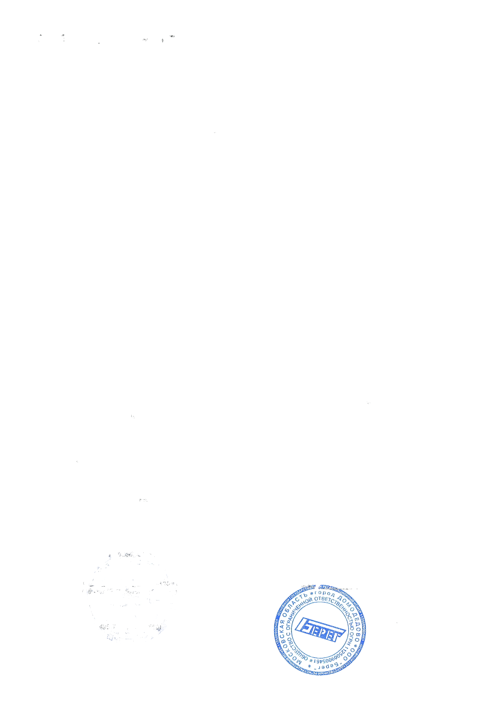
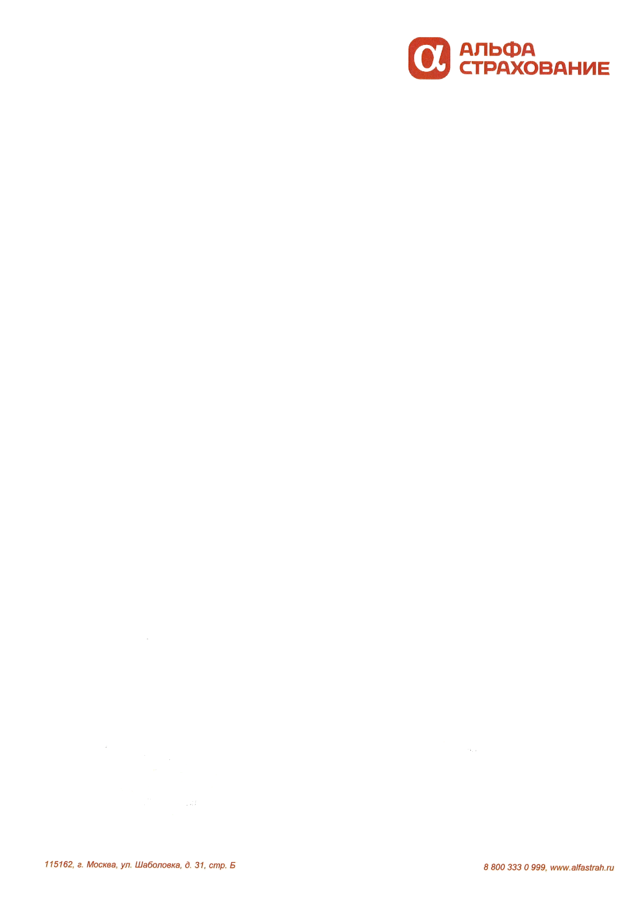
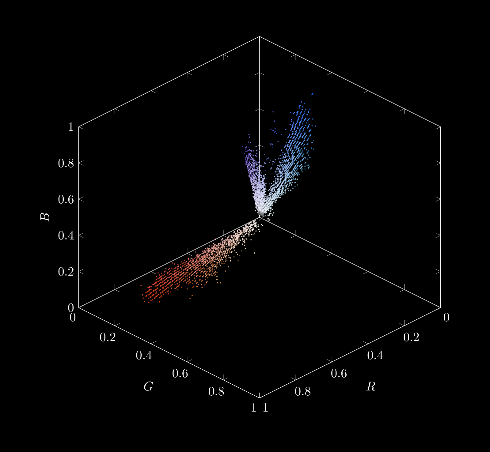
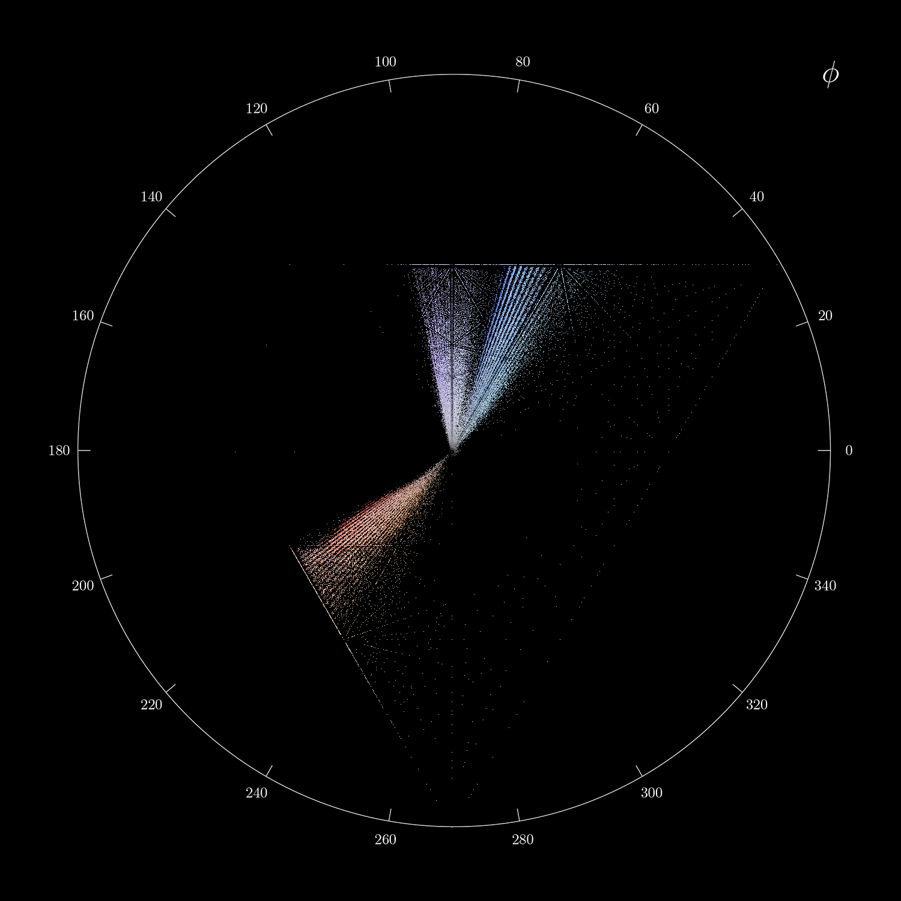
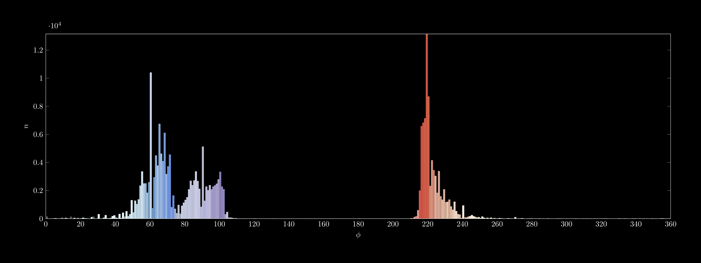
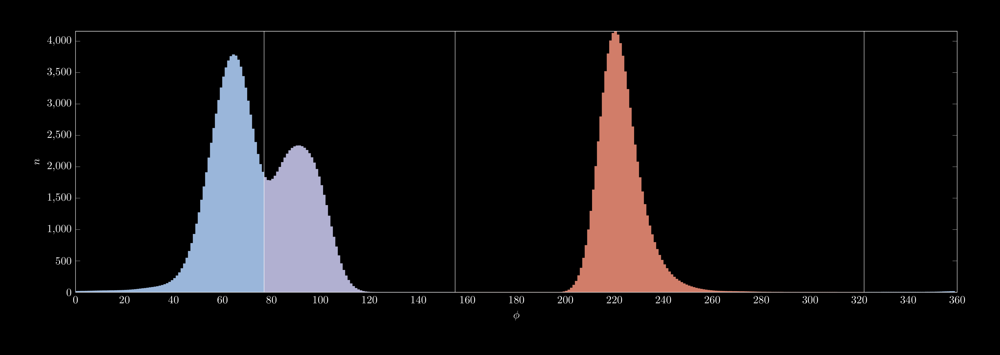

# [Doc Color Decomposer](https://github.com/Sh1kar1/doc-color-decomposer)

**Library for documents decomposition by color clustering created using C++ & OpenCV**

## Overview

### Demonstration

|  |  |  |  |  |
|:---------------:|:-------------------------:|:-------------------------:|:-------------------------:|:-------------------------:|
|    Document     |          Layer 1          |          Layer 2          |          Layer 3          |          Layer 4          |

|  |  |  |  |
|:-----------------------------:|:-----------------------------:|:-----------------------------:|:----------------------------------:|
|              RGB              |       $\ell\alpha\beta$       |            $\phi$             |              Clusters              |

### Features

- Customizable document color decomposition
- LaTeX visualizations generation
- Quality computation

### Details

Implementation of the following research article:
[documents-decomposition-by-color-clustering.pdf](assets/documents-decomposition-by-color-clustering.pdf)

1. Document colors projection onto the $\alpha\beta$ plane
2. Histogram calculation with respect to the angle $\phi$ in polar coordinates
3. Histogram smoothing using Gaussian filter
4. Clustering by peak detection in the smoothed histogram
5. Decomposition into layers via clusters

### Technologies

- C++ & CMake
- LaTeX
- [OpenCV](https://opencv.org/)
- [Doxygen](https://www.doxygen.nl/)

## Usage

### App

```
./doc-color-decomposer-app <path-to-image> <path-to-output-directory> [options]
```

|                     Option                     | Description                                         |
|:----------------------------------------------:|-----------------------------------------------------|
| `--groundtruth=<path-to-directory-with-masks>` | set path to truth image masks and compute quality   |
|       `--tolerance=<odd-positive-value>`       | set tolerance of decomposition (default: 35)        |
|                `--nopreprocess`                | disable image preprocessing by aberration reduction |
|                  `--masking`                   | save binary masks instead of layers                 |
|                 `--visualize`                  | save visualizations                                 |

### Interface

> [!IMPORTANT]
> The entire API is represented by the `DocColorDecomposer` class located in the `doc_color_decomposer` namespace

<br>

- ```c++
  explicit DocColorDecomposer(const cv::Mat& src, int tolerance = 35, bool preprocessing = true)
  ```

  Constructs an instance from the given document and precomputes its layers

  |    Parameter    | Description                                                                 |
  |:---------------:|-----------------------------------------------------------------------------|
  |      `src`      | source image of the document in the sRGB format                             |
  |   `tolerance`   | odd positive value with an increase of which the number of layers decreases |
  | `preprocessing` | true if the source image needs to be processed by aberration reduction      |

<br>

- ```c++
  std::vector<cv::Mat> GetLayers() const & noexcept
  ```

  Retrieves the precomputed layers

  Returns the list of the decomposed document layers with a white background in the sRGB format

<br>

- ```c++
  std::vector<cv::Mat> GetMasks() const & noexcept
  ```

  Retrieves the precomputed masks of the layers

  Returns the list of the binary masks of the layers in the grayscale format

<br>

- ```c++
  double ComputeQuality(const std::vector<cv::Mat>& truth_masks) const &
  ```

  Computes a Panoptic Quality (PQ) of the document decomposition (segmentation)

  Returns the value between 0 and 1 that represents a quality

  |   Parameter   | Description                                                   |
  |:-------------:|---------------------------------------------------------------|
  | `truth_masks` | list of the ground-truth binary masks in the grayscale format |

<br>

- ```c++
  std::string Plot3DRgb(double yaw = 135.0, double pitch = 35.25) &
  ```

  Generates a 3D scatter plot of the document colors in the linRGB space

  Returns the LaTeX code of the plot that can be saved in the .tex format and compiled

  | Parameter | Description                                 |
  |:---------:|---------------------------------------------|
  |   `yaw`   | yaw-rotation angle of the view in degrees   |
  |  `pitch`  | pitch-rotation angle of the view in degrees |

<br>

- ```c++
  cv::Mat Plot2DLab() &
  ```

  Generates a 2D scatter plot of the document colors projections on the $\alpha\beta$ plane

  Returns the image of the plot in the sRGB format

<br>

- ```c++
  std::string Plot1DPhi() &
  ```

  Generates a 1D histogram plot with respect to the angle $\phi$ in polar coordinates

  Returns the LaTeX code of the plot that can be saved in the .tex format and compiled

<br>

- ```c++
  std::string Plot1DClusters() &
  ```

  Generates a smoothed and separated by clusters 1D histogram plot

  Returns the LaTeX code of the plot that can be saved in the .tex format and compiled

### Example

```c++
#include <fstream>
#include <ranges>

#include <opencv2/imgcodecs/imgcodecs.hpp>

#include <doc_color_decomposer/doc_color_decomposer.h>

int main() {
  // (REQUIRED) Change paths with yours
  const std::filesystem::path kImagePath = "<path-to-image>";
  const std::filesystem::path kTruthMasksPath = "<path-to-directory-with-masks>";

  // Read source image and initialize decomposer
  cv::Mat src = cv::imread(kImagePath, cv::IMREAD_COLOR);
  doc_color_decomposer::DocColorDecomposer dcd = DocColorDecomposer(src);

  // (OPTIONAL) Read ground-truth masks for quality measurement
  std::vector<cv::Mat> truth_masks;
  for (const auto& truth_mask_file : std::filesystem::directory_iterator(kTruthMasksPath)) {
    truth_masks.push_back(cv::imread(truth_mask_file.path().string(), cv::IMREAD_GRAYSCALE));
  }

  // Write computed layers
  for (const auto& [layer_idx, layer] : dcd.GetLayers() | std::views::enumerate) {
    cv::imwrite("layer-" + std::to_string(layer_idx + 1) + ".png", layer);
  }

  // Write computed masks
  for (const auto& [mask_idx, mask] : dcd.GetMasks() | std::views::enumerate) {
    cv::imwrite("mask-" + std::to_string(mask_idx + 1) + ".png", mask);
  }

  // Write computed quality as text
  std::ofstream("quality.txt") << dcd.ComputeQuality(truth_masks);

  // Write 2D plot as image
  cv::imwrite("plot-2d-lab.png", dcd.Plot2dLab());

  // Write 3D and 1D plots as LaTeX code
  std::ofstream("plot-3d-rgb.tex") << dcd.Plot3dRgb();
  std::ofstream("plot-1d-phi.tex") << dcd.Plot1dPhi();
  std::ofstream("plot-1d-clusters.tex") << dcd.Plot1dClusters();

  return 0;
}
```

## License

Distributed under the Unlicense license - see [LICENSE](LICENSE) for more information
