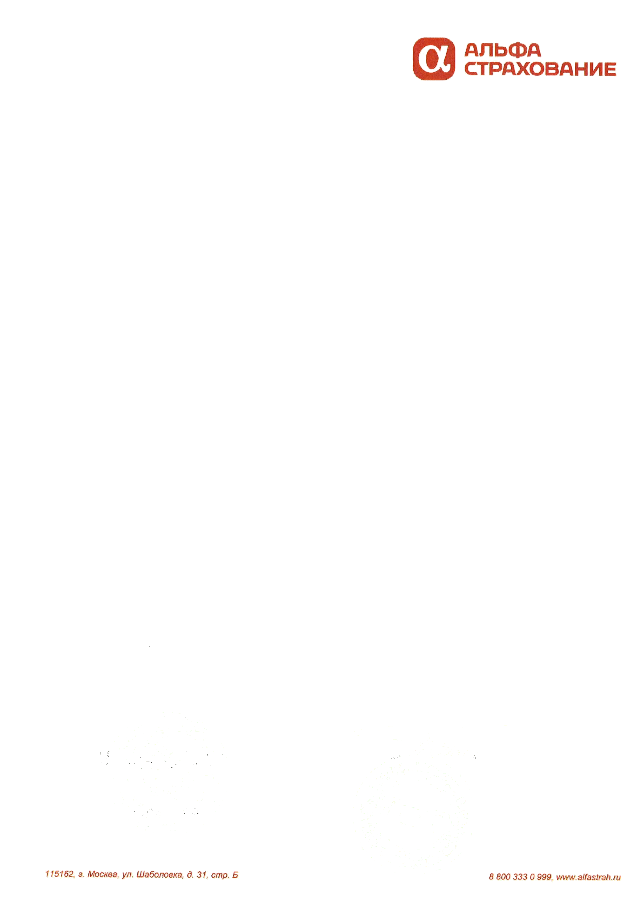
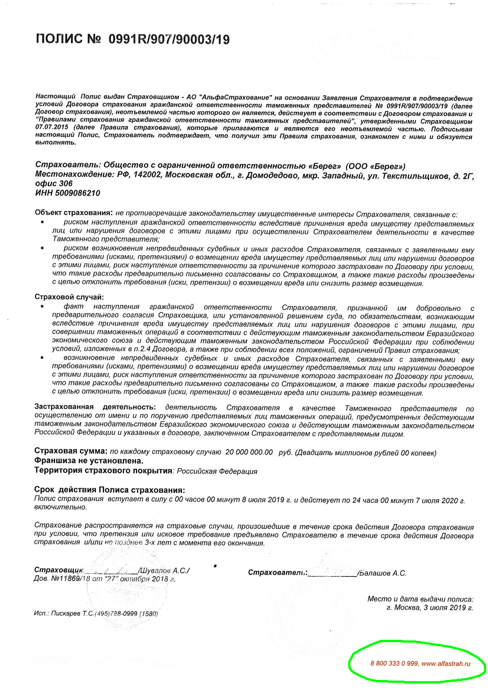
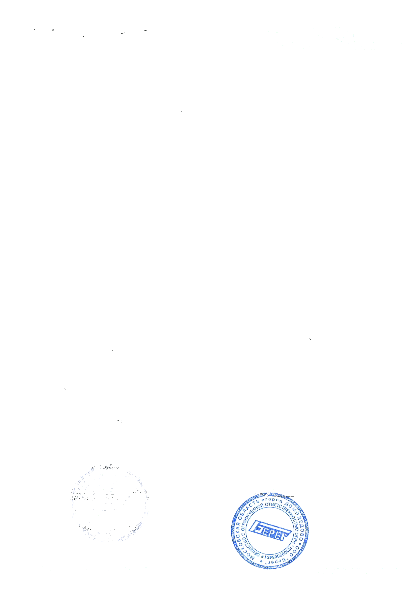
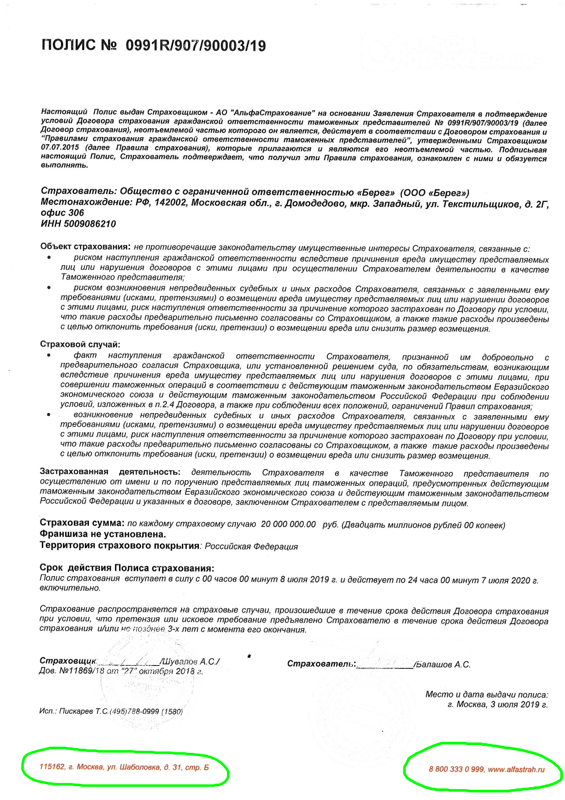
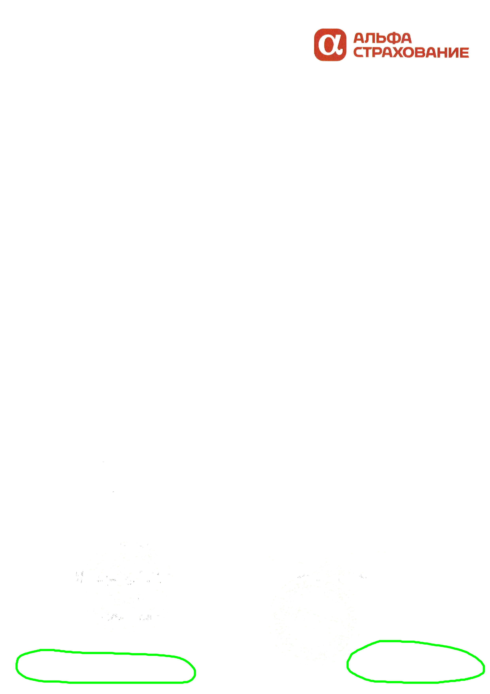
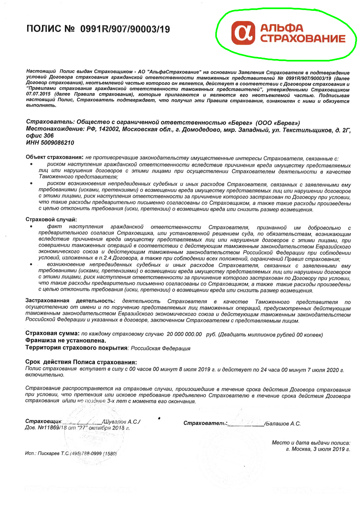
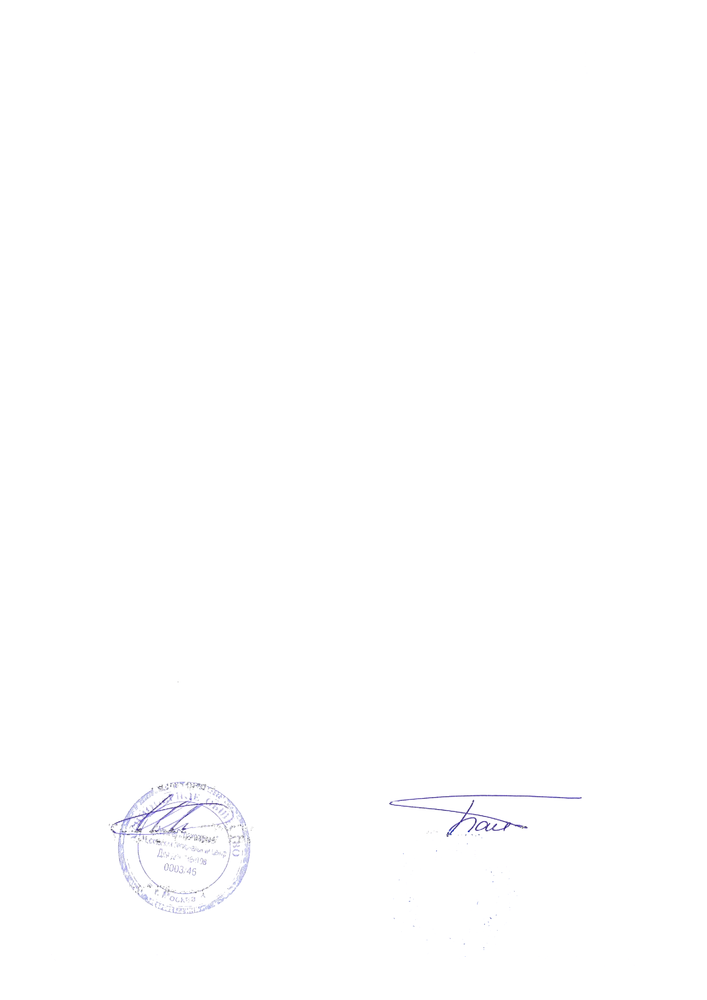
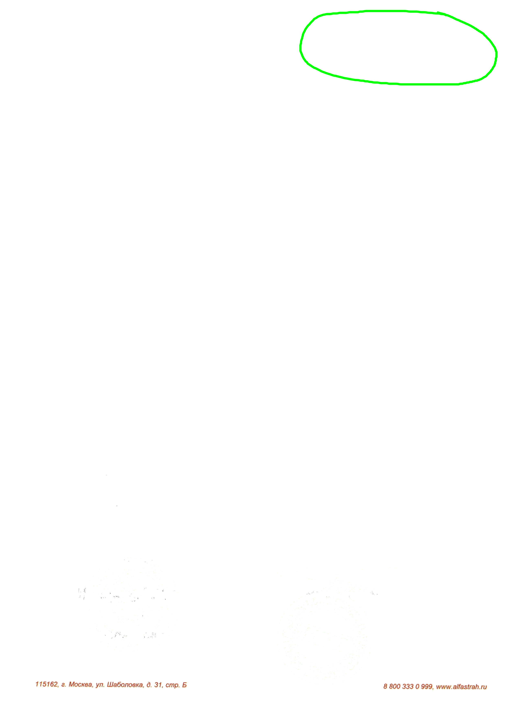
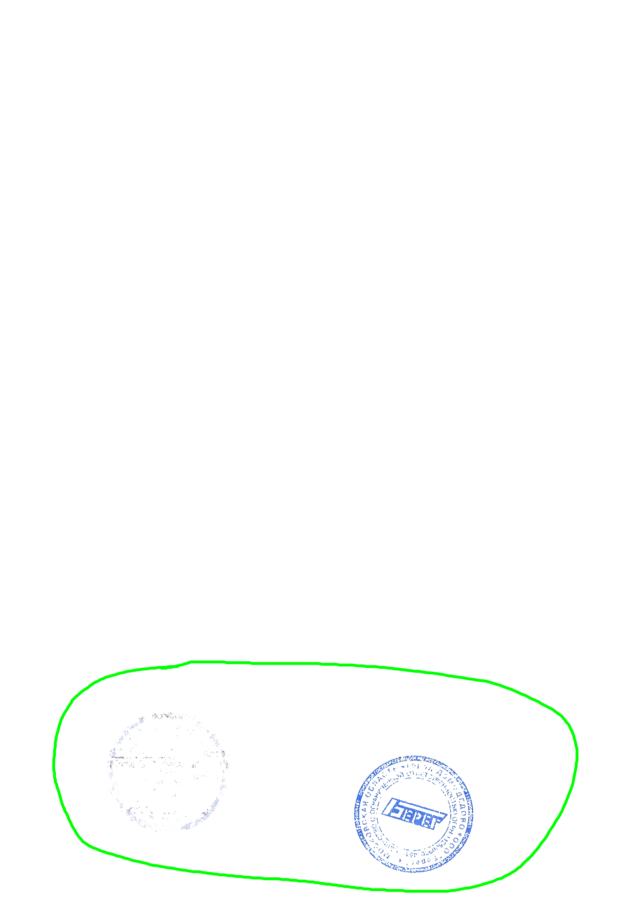

# Оценка качества цветового расслоения документов

## Метрика

[Panoptic Quality (PQ)](https://openaccess.thecvf.com/content_CVPR_2019/papers/Kirillov_Panoptic_Segmentation_CVPR_2019_paper.pdf)

## Особенности

- Варьируется в пределах от 0 до 1, чем ближе к единице - тем качественнее выполнено расслоение
- Учитывает не только совпадения пикселей, но и разницу в кол-ве истинных и предсказанных слоёв

## Примеры

### Истинное расслоение

|  |  |  |  |
|:----------------:|:----------------:|:----------------:|:----------------:|

### Пример 1

Перенесём оранжевую надпись в правом нижнем углу с четвёртого слоя на первый

Кол-во слоёв осталось прежним, но часть пикселей ошибочно отнесены к другому слою

|  |  |  |  |
|:------------:|:------------:|:------------:|:------------:|

Качество: **0.96**

Небольшое ухудшение соответствует небольшому промаху в расслоении

### Пример 2

Перенесём обе оранжевые надписи в нижней части с четвёртого слоя на первый

Кол-во слоёв осталось прежним, но ещё большая часть пикселей ошибочно отнесены к другому слою

|  |  |  |  |
|:------------:|:------------:|:------------:|:------------:|

Качество: **0.92**

Равномерное ухудшение по сравнению с предыдущим примером

### Пример 3

Оставим надписи на исходном слое, но перенесём большой оранжевый логотип в правом верхнем углу с четвёртого слоя на первый

Кол-во слоёв осталось прежним, но наибольшая часть пикселей одного из слоёв ошибочно отнесены к другому слою

|  |  |  |  |
|:------------:|:------------:|:------------:|:------------:|

Качество: **0.81**

Упало сильнее по сравнению с предыдущими примерами, поскольку большая часть пикселей на слое ошибочны

### Пример 4

Теперь вернёмся к исходным слоям и соединим второй и третий

Кол-во слоёв уменьшилось за счёт того что два склеились в один

|  |  |  |
|:------------:|:------------:|:------------:|

Качество: **0.75**

Упало сильно из-за уменьшения кол-ва слоёв

### Пример 5

Вместо соединения теперь разделим второй слой

Кол-во слоёв увеличилось за счёт того что один разделился на две части

|  |  |  |  |  |
|:------------:|:------------:|:------------:|:------------:|:------------:|

Качество: **0.76**

Упало сильно из-за увеличения кол-ва слоёв, но примерно одинаково с предыдущим примером
