# Оценка качества цветового расслоения документов

## Метрика

[Panoptic Quality (PQ)](https://openaccess.thecvf.com/content_CVPR_2019/papers/Kirillov_Panoptic_Segmentation_CVPR_2019_paper.pdf)

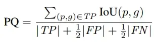

## Особенности

- Варьируется в пределах от 0 до 1, чем ближе к единице - тем качественнее выполнено расслоение
- Учитывает не только совпадения пикселей, но и разницу в кол-ве истинных и предсказанных слоёв

## Примеры

### Истинное расслоение

|  | 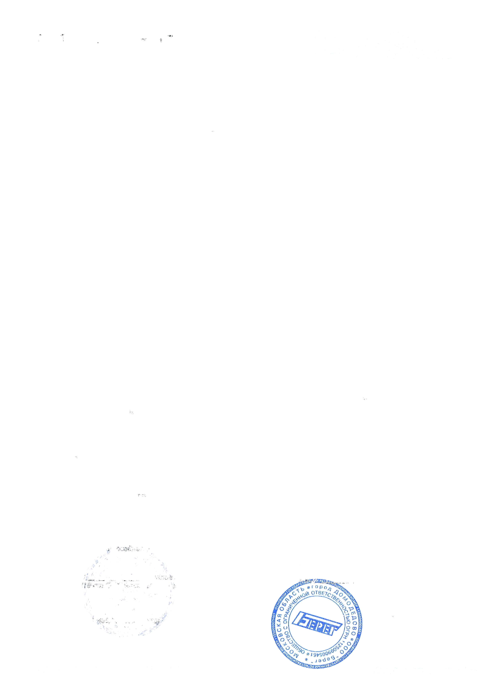 |  | 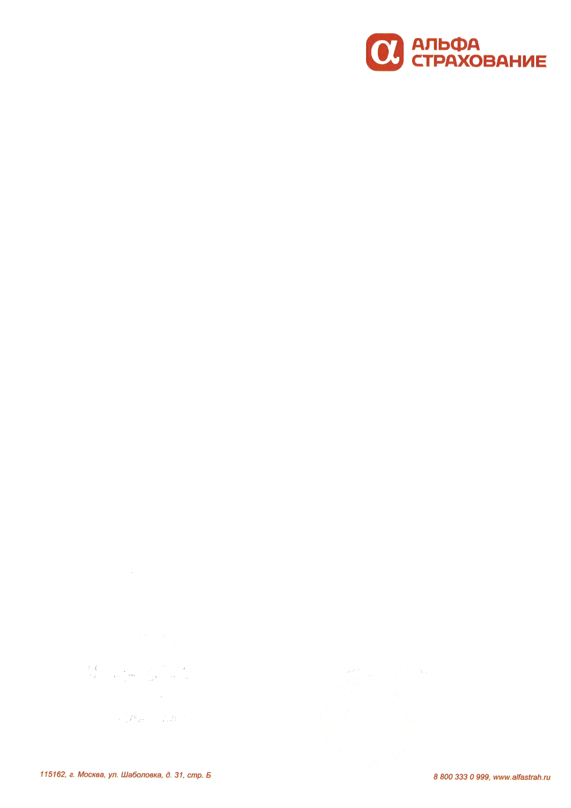 |
|:----------------:|:----------------:|:----------------:|:----------------:|

### Пример 1

Перенесём оранжевую надпись в правом нижнем углу с четвёртого слоя на первый
(кол-во слоёв осталось прежним, но часть пикселей ошибочно отнесены к другому слою)

| 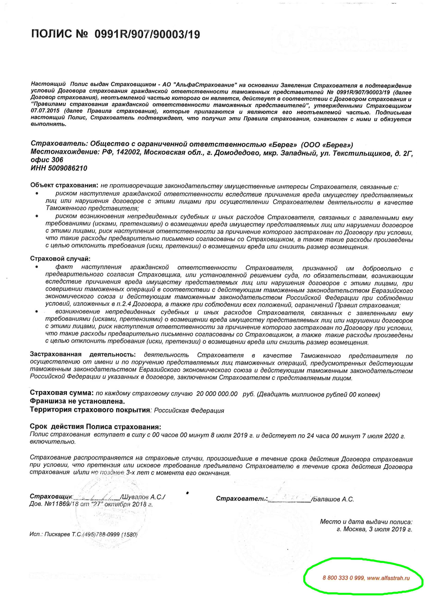 |  |  | 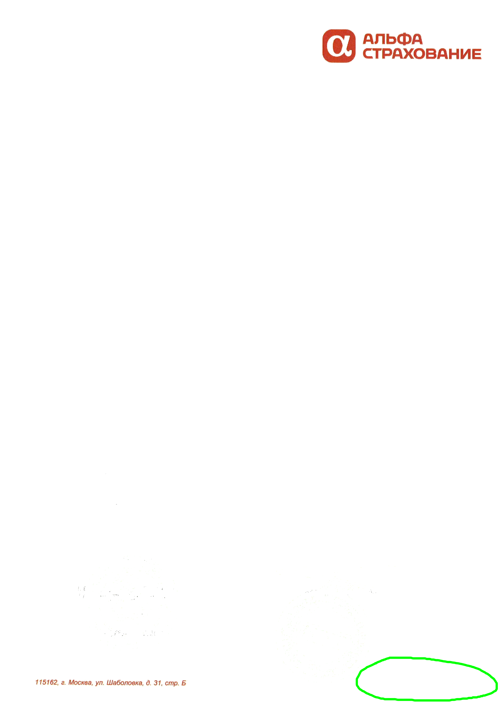 |
|:------------:|:------------:|:------------:|:------------:|

Качество: **0.96**
(небольшое ухудшение соответствует небольшому промаху в расслоении)

### Пример 2

Перенесём обе оранжевые надписи в нижней части с четвёртого слоя на первый
(кол-во слоёв осталось прежним, но ещё большая часть пикселей ошибочно отнесены к другому слою)

| 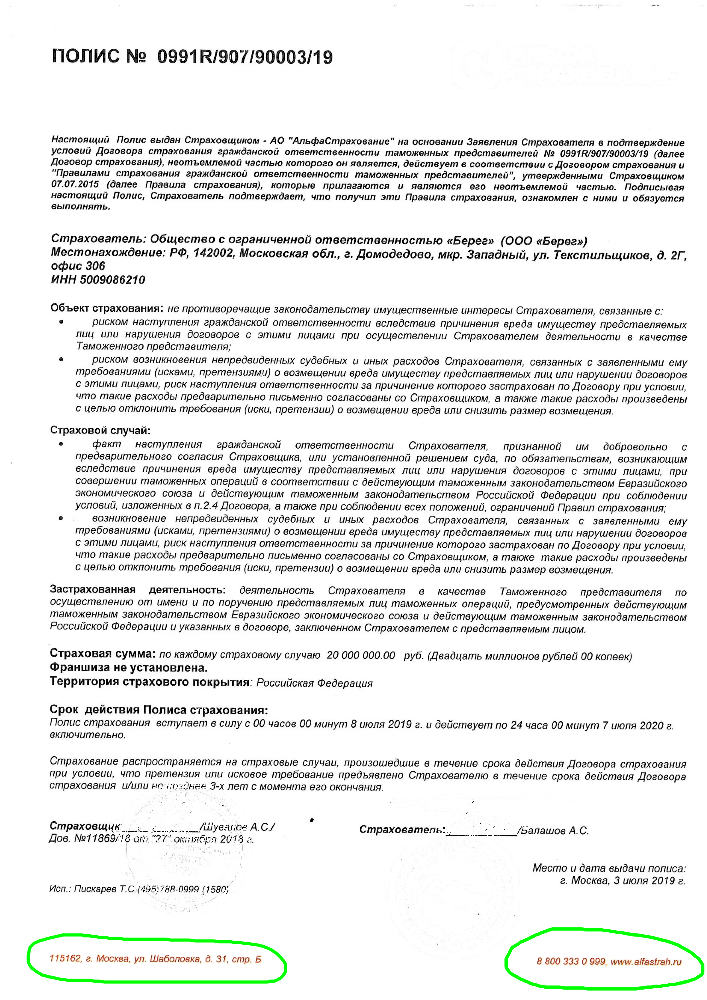 |  |  | 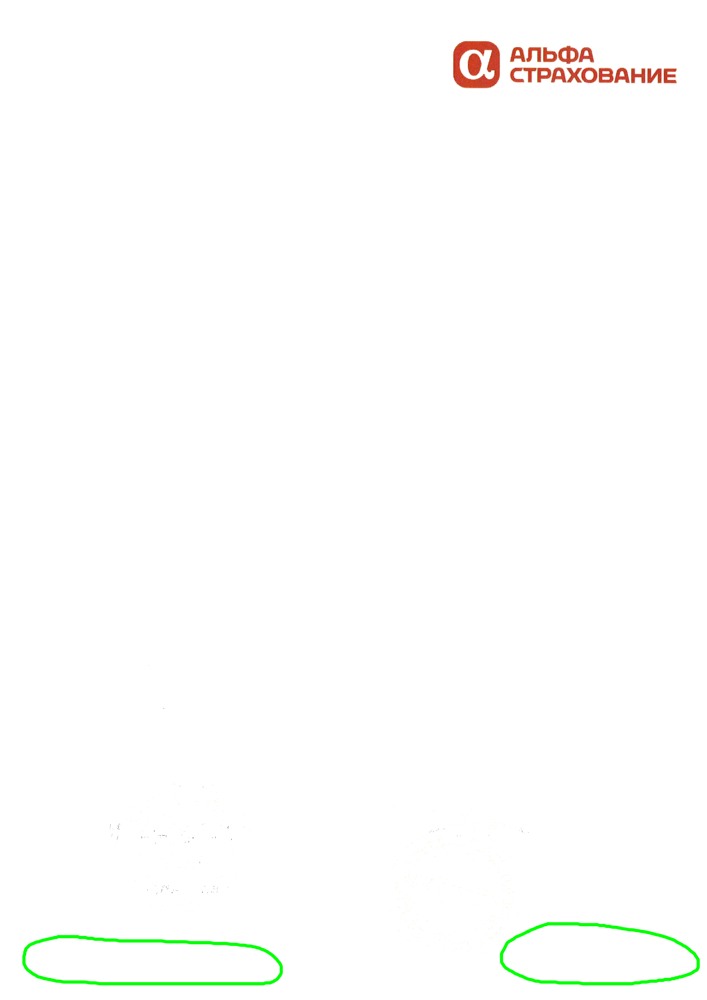 |
|:------------:|:------------:|:------------:|:------------:|

Качество: **0.92**
(равномерное ухудшение по сравнению с предыдущим примером)

### Пример 3

Оставим оранжевые надписи внизу на исходном слое, но перенесём большой оранжевый логотип в правом вернем углу с четвёртого слоя на первый
(кол-во слоёв осталось прежним, но наибольшая часть пикселей одного из слоёв ошибочно отнесены к другому слою)

| 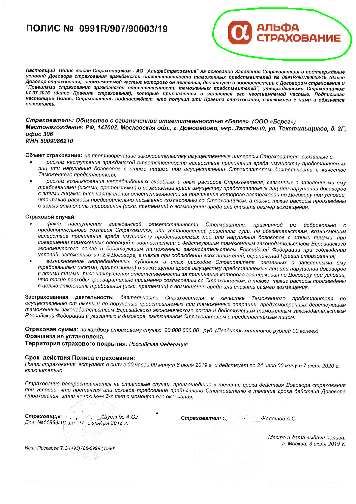 |  |  | 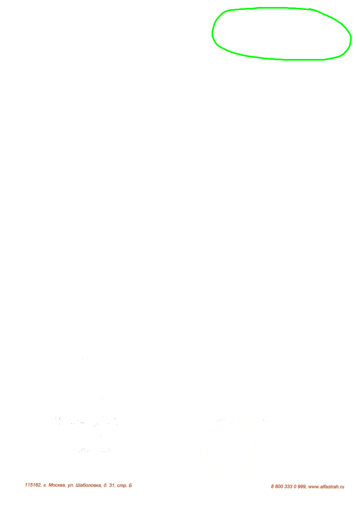 |
|:------------:|:------------:|:------------:|:------------:|

Качество: **0.81**
(упало сильнее по сравнению с предыдущими примерами, поскольку большая часть пикселей на слое ошибочны)

### Пример 4

Теперь вернёмся к исходным слоям и соединим второй и третий
(кол-во слоёв уменьшилось за счёт того что два склеились в один)

| 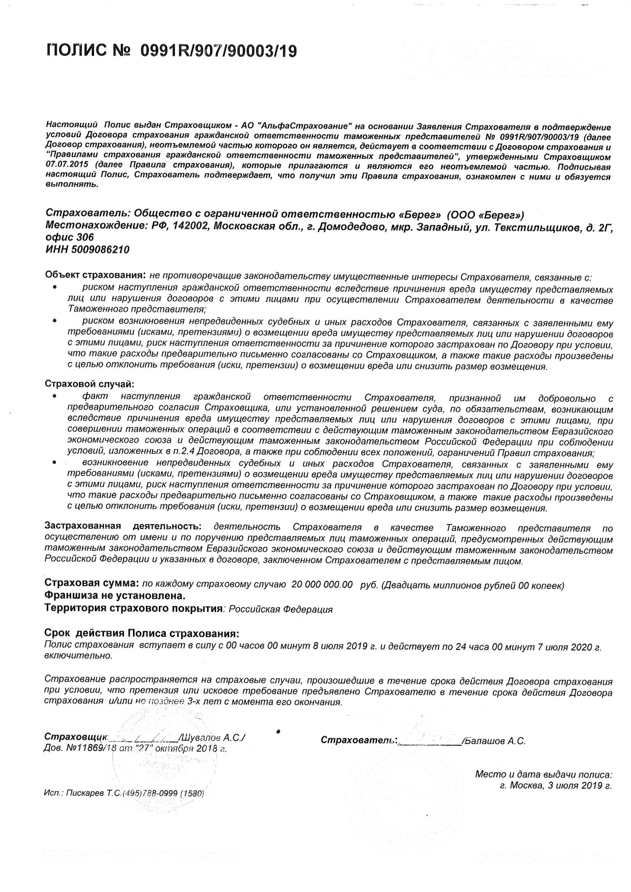 | 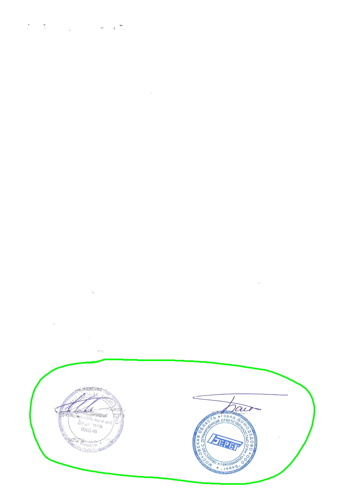 |  |
|:------------:|:------------:|:------------:|

Качество: **0.75**
(упало сильно из-за уменьшения кол-ва слоёв)

### Пример 5

Вместо соединения теперь разделим второй слой
(кол-во слоёв увеличилось за счёт того что один разделился на две части)

|  | 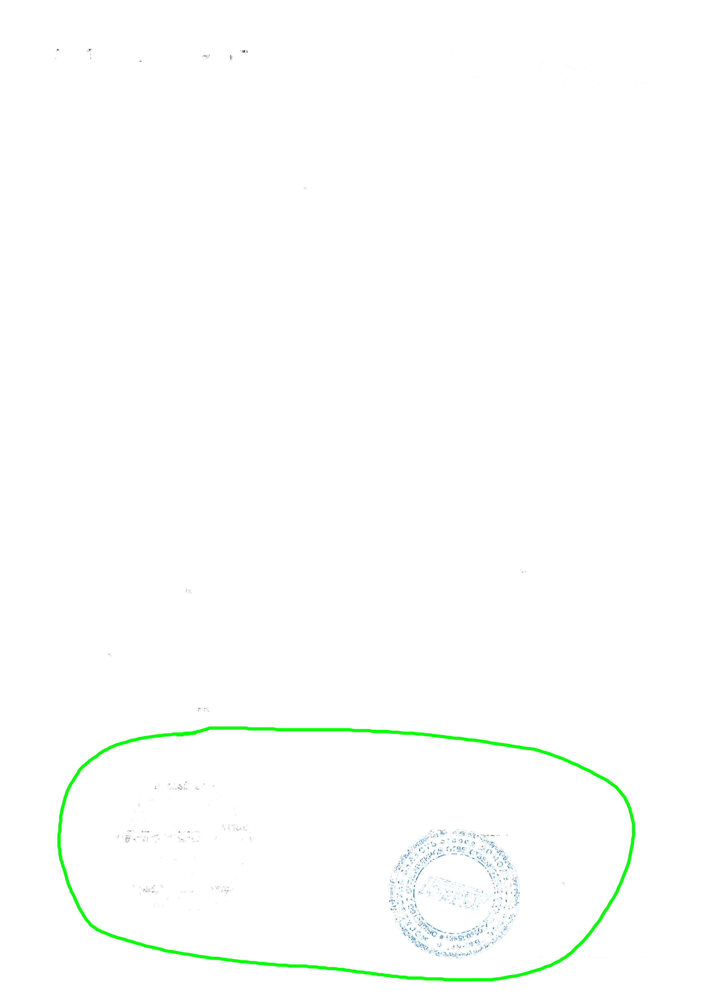 |  |  |  |
|:------------:|:------------:|:------------:|:------------:|:------------:|

Качество: **0.76**
(упало сильно из-за увеличения кол-ва слоёв, но примерно одинаково с предыдущим примером)
